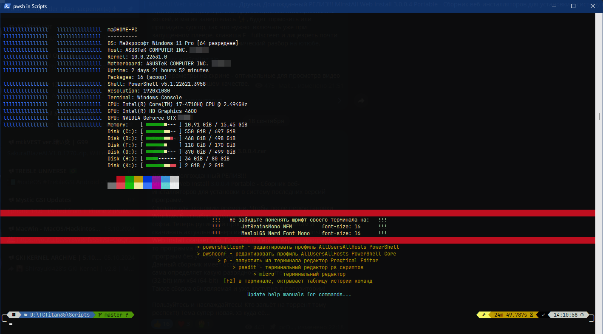



▼▲◤◥◣◢•●◉«»➤🡆🡹🡸🡺🡹🡻🡼🡽🡾🡿◆❖✦★✪✠✿✱✚†‡▬▔■▪▣◩◪◧◨∎▮░▒▓▌█▐【】

## Описание

Данный скрипт предназначен для автоматической установки или обновления расширенного пакета программ и библиотек
глобального пользовательского окружения, что бы при смене учётной записи не перенастраивать среду.</br>
</br>
## Устанавливаемые пакеты

Не составит труда добавить или comment/uncomment группы нужных пакетов.

WinGet, Scoop - пакетные менеджеры</br>
PowerShell Core - <https://github.com/PowerShell/PowerShell></br>
Microsoft Edge WebView2 Runtime</br>
Microsoft Visual C++ 2005/2008/2010/2012/2013/2015+ Redistributable</br>
\# Microsoft Visual Studio C++ x64/x86 Build Tools - <https://visualstudio.microsoft.com/ru/downloads/#build-tools-for-visual-studio-2022></br>
Microsoft .NET Desktop 3.1/5/6/7/8/Preview</br>
Microsoft .NET Framework 2/3/4.5/4@latest</br>
\# Microsoft ASP.NET Core 2/3/5/6/7/8/Preview</br>
\# DirectX Web Installer</br>
\# Java Runtime Environment</br>
Java Software Development Kit</br>
Git - <https://gitforwindows.org></br>
Clink - <https://chrisant996.github.io/clink></br>
NodeJS - <https://nodejs.org></br>
Python - <https://python.org></br>
PHP - <https://windows.php.net></br>
MinGW - <https://winlibs.com></br>
WinFsp - <https://winfsp.dev></br>
WinFetch - <https://github.com/lptstr/winfetch></br>
Zoxide - <https://github.com/ajeetdsouza/zoxide></br>
micro - <https://micro-editor.github.io></br>
Pragtical - <https://pragtical.dev> - для редактирования конфигов, language source файлов</br>
oh-my-posh - <https://ohmyposh.dev> - быстрый движок тем для любой оболочки PowerShell</br>
wget, curl, aria2 - web network утилиты</br>
PowerShell scripts, modules - улучшают и расширяют функциональность PowerShell</br>
</br>
## Запуск скрипта можно осуществить различными способами

Проще всего запустить через ПКМ на файле скрипта.</br>
</br>
### Скрипт самостоятельно определит профили PowerShell, PowerShell Core из переменных окружения

▶ `powershell -ExecutionPolicy Bypass -File install_advanced_user_environment.ps1`</br>
▶ `pwsh -ExecutionPolicy Bypass -File install_advanced_user_environment.ps1`</br>
</br>
### С параметрами

Что бы не указывать параметры их можно переопределить в разделе `##### Init #####`.</br>
Скрипт поддерживает установку, обновление, удаление скриптов, модулей.

Поддерживает добавление, обновление, удаление multiline конфигурационных строк по шаблону поиска.</br>
Назначение модулей/скриптов для установки только для PowerShell Core.

▶ `powershell -ExecutionPolicy Bypass -File install_advanced_user_environment.ps1 -Theme Theme -Fonts Font1 Font2`</br>
▶ `powershell -ExecutionPolicy Bypass -File install_advanced_user_environment.ps1 -Scripts Script1 Script2`</br>
▶ `powershell -ExecutionPolicy Bypass -File install_advanced_user_environment.ps1 -ModulesNoImport Module1 Module2`</br>
▶ `powershell -ExecutionPolicy Bypass -File install_advanced_user_environment.ps1 -Modules Module3 Module4`</br>

-Theme - название темы <https://ohmyposh.dev/docs/themes></br>
-Fonts - имена семейства шрифтов Nerd Fonts <https://ohmyposh.dev/docs/installation/fonts></br>
-Scripts - имена скриптов <https://powershellgallery.com></br>
-ModulesNoImport - установить модули, не добавлять импорты в профиль <https://powershellgallery.com></br>
-Modules - установить модули, добавить импорты в профиль <https://powershellgallery.com></br>
-ResourceOnlyCore - выбрать имена скриптов/модулей только для PowerShell Core</br>
</br>
### С указанием конкретного профиля

▶ `powershell -ExecutionPolicy Bypass -File install_advanced_user_environment.ps1 -ProfilePath $PROFILE -Shell powershell`

-ProfilePath - полный путь к конкретному профилю и работать только с ним</br>
-Shell - применяется, если указан -ProfilePath, по умолчанию тип профиля PowerShell Core, для профиля PowerShell нужно указать значение параметра "powershell"</br>
</br>
### С правами администратора

▶ `powershell -NoProfile -ExecutionPolicy Bypass -NonInteractive -File install_advanced_user_environment.ps1`</br>
▶ `pwsh -NoProfile -ExecutionPolicy Bypass -NonInteractive -File install_advanced_user_environment.ps1`

Если скрипт исполняется без административных прав, то он самостоятельно запросит права и запустить powershell</br>
с опцией `-NoProfile`, что бы не загружать модули прописанные в профиле.</br>
</br>
### psedit - терминальный редактор ps скриптов, c intellisense и подсветкой синтаксиса

[F5] - выполнить скрипт</br>
[Ctrl] + [Shift] + [F5] - выполнить скрипт вне редактора</br>
[F8] - выполнить, выделенные строки</br>
[Ctrl] + [Shift] + [R] - форматировать текст</br>
[Ctrl] + [Q] - exit</br>
</br>
### Pragtical Editor

Через scoop создан shim link на Pragtical, запуск из терминала:</br>
▶ p - откроет редактор с файлами из прошлой сесии</br>
▶ p FileName - откроет существующий файл или создаст новую вкладку</br>
▶ powershellconf - редактировать профиль AllUsersAllHosts PowerShell</br>
▶ pwshconf - редактировать профиль AllUsersAllHosts PowerShell Core</br>

▼ Горячии клавиши ▼</br>
<https://pragtical.dev/docs/user-guide/keymap>

[ctrl] + [shift] + [P] - поиск команды</br>
[alt] + [P] - переключаться между открытыми вкладками</br>
[ctrl] + [shift] + [T] - открыть последнюю закрытыю вкладку</br>
[ctrl] + [.] - открыть console</br>
[ctrl] + [shift] + [.] - запустить команду в console</br>
[alt] + [T] - открыть terminal</br>
[alt] + [🡸] - вернуться к предыдущей позиции</br>
[alt] + [🡺] - вернуться последней позиции</br>
[ctrl] + [enter] - открыть url ссылку в браузере</br>
[ctrl] + [/] - комменитровать строку</br>
[ctrl] + [shift] + [/] - комменитровать блок</br>
</br>

## Кнопка для панели Total Commander

Скопировать все файлы репозитория в папку `%COMMANDER_PATH%\Scripts\`</br>
Скопировать данный код и через ПКМ на панели кнопок выбрать опцию "Вставить"</br>

```
TOTALCMD#BAR#DATA
%altrun%
--run="%%WINDIR%%\sysnative\WindowsPowerShell\v1.0\powershell.exe" --par="-ExecutionPolicy Bypass -File install_advanced_user_environment.ps1"
"%COMMANDER_PATH%\Scripts\install_advanced_user_environment.ico"
WinGet, Scoop - пакетные менеджеры|PowerShell Core|Microsoft Edge WebView2 Runtime|Microsoft Visual C++ 2005/2008/2010/2012/2013/2015+|Microsoft .NET Desktop 3.1/5/6/7/8/Preview|Microsoft .NET Framework 2/3/4.5/4@latest
%COMMANDER_PATH%\Scripts\
0
-1
```
